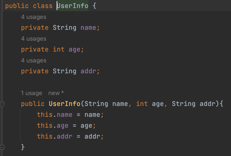

# Builder

* 만약 위와 같이 유저 정보를 입력하는 객체를 생성한다고 했을 때, 생성자로
  유저를 생성할 경우 안좋은 점들이 있다.

1. 불변성이 보장되지 않는다.
2. 생성자로 생성 할 시 입력 순서가 잘못되면 제대로 된 값을 넣지 못할 수 있다.
3. 만약 유효성 검사까지 하게된다면 정확한 값이 아니면 오류를 낼 수 있다.
4. 필수 입력값이 아닌경우에는 하드코딩으로 기본값을 지정해 주어야 한다.

* 세터를 사용한다면 처음 생성할 때는 값을 넣어주지 않아도 되고 꼭 필요한 값만
나중에 따로 세터로 지정해 줄 수 있다.
* 하지만, 세터를 사용한다면 값을 입력하는데에는 훨씬 가독성이 높아지지만 값이
계속해서 변경될 수 있다.
* 그리고 만약 클래스가 가지고 있는 인스턴스 변수가 늘어난다면 세터를 더많이
작성해야 한다.

* 이 경우에는 빌더를 사용한다면 더 이해하기 쉽고 생성할 때 필수 입력값이
아닌 값에 대해 꼭 입력하지 않아도 되는 방식으로 만들 수 있다.

* 위의 빌더 클래스를 살펴보자
* 빌더 클래스를 사용하면 build 메서드를 사용하기 이전까지는 모두
빌더클래스를 반환한다.
* 사용법은 다음과 같다.

* 생성한 객체들을 출력하면 다음과 같다.

* 이렇듯 코드가 매우 간결하고 가독성이 뛰어나 졌다.
* 하지만 항상 빌드가 좋은것만은 아니며 분명 좋지않은 경우도 있을것이다.
* 객체의 인스턴스 변수가 적은경우, 모두 필수로 입력해야만 하는경우 (만약 꼭 넣어줘야 
하는 값을 깜빡하고 생략할 수도 있음)등등이 있을거같다.