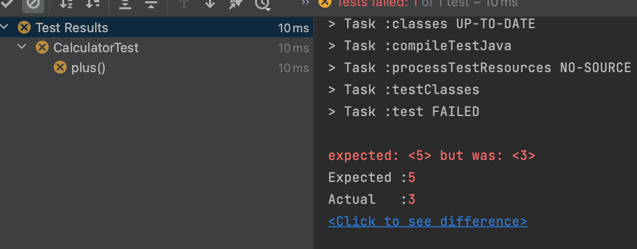
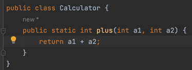

# TDD 시작

---

## TDD란?

---
* TDD는 테스트 부터 시작한다.
* 기능을 검증하는 테스트 코드를 먼저 작성하고 테스트를 통과시키기 위해 개발을 진행한다.

* 실패하는 코드를 먼저 작성한다.

* 테스트가 통과할 수 있게끔 코드를 구현한다.

* 테스트가 통과하면 검증할 코드를 하나 더 추가한다.

* 테스트가 통과하는지 확인한다.

* 실패하는 테스트가 성공할 수 있게끔 수정한다.

* 테스트가 성공하는지 확인한다.

* 테스트가 통과하면 일반 소스파일로 옮기고 배포 가능한 상태로 바꾼다.

* 기능을 검증하는 테스트 코드를 먼저 작성한다.
* 테스트 대상이 될 클래스 이름, 메서드 이름, 파라미터 개수, 리턴타입을 고민한다.
* 새로운 객체를 생성할지 아니면 정적 메서드로 구현할지 등을 고민한다.

1. 테스트 코드를 작성한 뒤에는 컴파일 오류를 없애는 데 필요한 클래스와 메서드를 작성한다.
2. 테스트를 진행한 후 테스트에 실패한다.
3. 실패한 이유를 확인하고 테스트를 통과할 만큼만 코드를 구현한다.
4. 실패한 테스트를 통과시킨 뒤에 새로운 테스트를 추가하고 다시 그 테스트를 통과시키기 위한 코드를 작성한다.
5. TDD는 테스트를 먼저 작성하고 테스트에 실패하면 테스트를 통과시킬 만큼 코드를 추가하는 과정을 반복하면서 
점진적으로 기능을 완성해 나간다.

---
#### 테스트 코드의 중복을 무턱대고 제거하면 안된다.
#### 중복을 제거하더라도 가독성이 떨어지지 않고 수정이 용이한 경우에만 중복을 제거해야 한다.
#### 중복을 제거한 뒤 테스트 코드의 관리가 어려워지면 제거했던 중복을 되돌려야 한다.

---

* 테스트 코드를 작성하는 과정에서 값이 없는 경우도 꼭 테스트를 해줘야 한다.